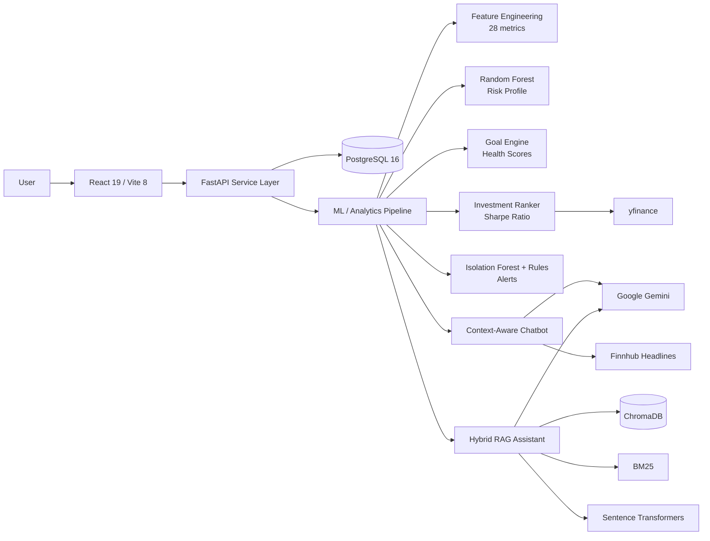

# WISE — AI-Powered Personal Finance Platform

> **Documentation-first portfolio repository** for an Arizona State University graduate capstone that combines machine learning, financial analytics, Retrieval-Augmented Generation (RAG), and a full-stack web architecture.


## Overview

WISE (Wealth Investment & Strategy Engine) is a full-stack personal-finance decision-support platform designed to move beyond passive expense tracking. It analyzes transaction behavior, estimates financial risk, tracks goals, ranks investment options, detects unusual spending patterns, and provides grounded financial explanations through conversational AI.

The system combines:

- **28 behavioral and transaction-derived features**
- **Random Forest** risk classification
- **Isolation Forest** anomaly detection
- Rule-based overspending and savings-drop checks
- **Sharpe-ratio-based ranking** across a 50-asset universe
- A context-aware financial chatbot
- A hybrid **BM25 + semantic-search RAG** learning assistant
- **FastAPI**, **PostgreSQL**, **SQLAlchemy**, and a **React** frontend

The implementation was evaluated with simulated financial profiles. The reported holdout accuracy for risk classification was **87%**, and the complete five-stage onboarding pipeline completed in approximately **5–15 seconds** in the project environment.

> **Accuracy note:** All performance figures in this repository are project evaluation results based on synthetic or simulated data. They are not production benchmarks or financial-performance guarantees.

## Why This Repository Is Documentation-First

The original application source code is not included in this public repository. This portfolio version documents the problem, architecture, data pipeline, model design, evaluation approach, engineering decisions, and representative system behavior.

It is intended to demonstrate:

- System-design reasoning
- Applied machine-learning methodology
- RAG and LLM integration
- Backend/API architecture
- Data validation and persistence design
- Evaluation awareness and production tradeoffs

This repository does **not** claim sole authorship of the academic capstone. See [Project Attribution](#project-attribution) and [NOTICE.md](NOTICE.md).

## Business Problem

Many personal-finance products visualize income and expenses but leave users to interpret the charts themselves. WISE was designed to turn raw financial activity into decisions:

1. What does the user’s behavior indicate about financial risk?
2. Which goals are on track, at risk, or delayed?
3. Are there unusual spending events or deteriorating savings patterns?
4. Which investment options match the user’s financial stage and risk profile?
5. How can the system explain these results in grounded, understandable language?

## System Architecture



The backend coordinates a five-stage onboarding workflow:

1. Compute financial features from transaction history.
2. Classify the user’s risk profile.
3. rank investment candidates and build an action plan.
4. Generate and score standard financial goals.
5. Detect anomalies, overspending, and savings deterioration.

Read the detailed architecture in [`docs/architecture.md`](docs/architecture.md).

## Key Modules

| Module | Purpose | Core Methods |
|---|---|---|
| Feature Engineering | Converts transactions into behavioral signals | pandas aggregations, trend estimation, ratios |
| Risk Profiling | Assigns Conservative, Moderate, or Aggressive profile | Random Forest + behavioral/self-report blending |
| Goal Engine | Generates targets and evaluates progress | financial rules, health-score rubric |
| Investment Ranker | Selects suitable assets and allocations | annualized return, volatility, Sharpe ratio |
| Alert Engine | Detects unusual or harmful patterns | Isolation Forest + financial thresholds |
| RAG Assistant | Answers educational finance questions from documents | sentence-transformers, ChromaDB, BM25, Gemini |
| Financial Chatbot | Explains personal results using live user context | structured context injection, prompt controls |
| Persistence Layer | Stores profiles, transactions, features, goals, and AI outputs | PostgreSQL, SQLAlchemy |

## Technology Stack

**Backend and APIs:** Python 3.11, FastAPI, Uvicorn, Pydantic  
**Database:** PostgreSQL 16, SQLAlchemy 2.0  
**Machine Learning:** scikit-learn, pandas, NumPy  
**Retrieval:** sentence-transformers, ChromaDB, rank-bm25, PyMuPDF  
**Generative AI:** Google Gemini  
**Market Context:** yfinance, Finnhub  
**Frontend:** React 19, Vite 8, Axios

## My Contribution

My work focused on the data-processing and AI/ML portions of the capstone, including:

- Financial-data preprocessing and transaction normalization
- Engineering behavioral and transaction-derived features
- Supporting risk-classification and anomaly-detection workflows
- Building retrieval logic using semantic embeddings, ChromaDB, and BM25
- Constructing user-specific context for the financial chatbot
- Connecting model and retrieval outputs to FastAPI service responses
- Adding structured validation, retry handling, caching, and failure-aware behavior

The capstone was completed as a team project. This repository presents my technical understanding and contribution without claiming exclusive ownership of the full system.

## Results

| Evaluation Area | Reported Result |
|---|---|
| Risk classification | 87% holdout accuracy on synthetic data |
| Evaluation population | 200 simulated users across five income groups |
| Feature set | 28 financial and behavioral metrics |
| Risk-model inputs | 22 selected features |
| Investment universe | 50 assets |
| Full onboarding workflow | Approximately 5–15 seconds |
| RAG retrieval | Hybrid semantic and BM25 retrieval |
| Generative inference | Gemini API; local ML inference elsewhere |

See [`docs/evaluation.md`](docs/evaluation.md) for interpretation and limitations.

## Engineering Challenges

The project required balancing system quality, cost, and reliability. Key challenges included:

- Exact financial terms were sometimes missed by vector-only search.
- Keyword-only retrieval lacked semantic context.
- Gemini requests could encounter rate limits or temporary service failures.
- LLM outputs required structured validation before persistence or display.
- Frontend/backend configuration mismatches could break local integration.
- Financial outputs needed safeguards so they were explanatory rather than presented as professional financial advice.

The resulting design used hybrid retrieval, evidence-aware prompts, JSON-oriented outputs, Pydantic validation, caching, retry logic, and explicit limitations.

Read [`docs/challenges-and-decisions.md`](docs/challenges-and-decisions.md).

## Repository Structure

```text
wise-ai-finance-platform/
├── README.md
├── NOTICE.md
├── CODE_AVAILABILITY.md
├── REPOSITORY_SETUP.md
├── .env.example
├── .gitignore
├── requirements.txt
├── docs/
│   ├── architecture.md
│   ├── data-and-ml-pipeline.md
│   ├── rag-and-chatbot.md
│   ├── evaluation.md
│   ├── challenges-and-decisions.md
│   ├── limitations-and-future-work.md
│   └── project-explanation.md
├── examples/
│   └── representative-queries.md
└── assets/
    └── README.md
```

## Documentation Index

- [System Architecture](docs/architecture.md)
- [Data and ML Pipeline](docs/data-and-ml-pipeline.md)
- [RAG and Chatbot Design](docs/rag-and-chatbot.md)
- [Evaluation](docs/evaluation.md)
- [Challenges and Engineering Decisions](docs/challenges-and-decisions.md)
- [Limitations and Future Work](docs/limitations-and-future-work.md)
- [Recruiter-Ready Project Explanation](docs/project-explanation.md)
- [Representative Queries](examples/representative-queries.md)

## Project Attribution

WISE was an Arizona State University graduate capstone completed as a team project. This repository is maintained as Vaishnavi Reddy Kunduri’s documentation-focused portfolio representation of the work and her contribution.

The repository:

- Does not claim sole authorship
- Does not include private credentials, personal financial data, or proprietary source code
- Uses simulated evaluation results where stated
- Is not a financial advisory product

## Disclaimer

WISE is an academic and portfolio project. Its outputs are educational demonstrations and should not be interpreted as personalized investment, tax, legal, or financial advice.
